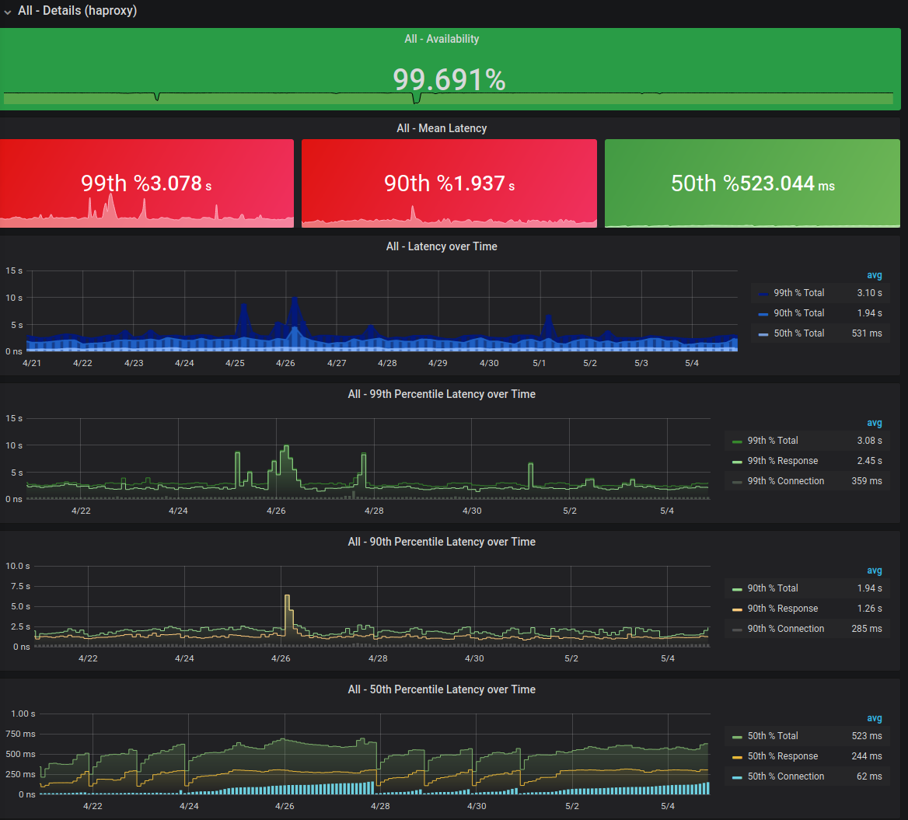
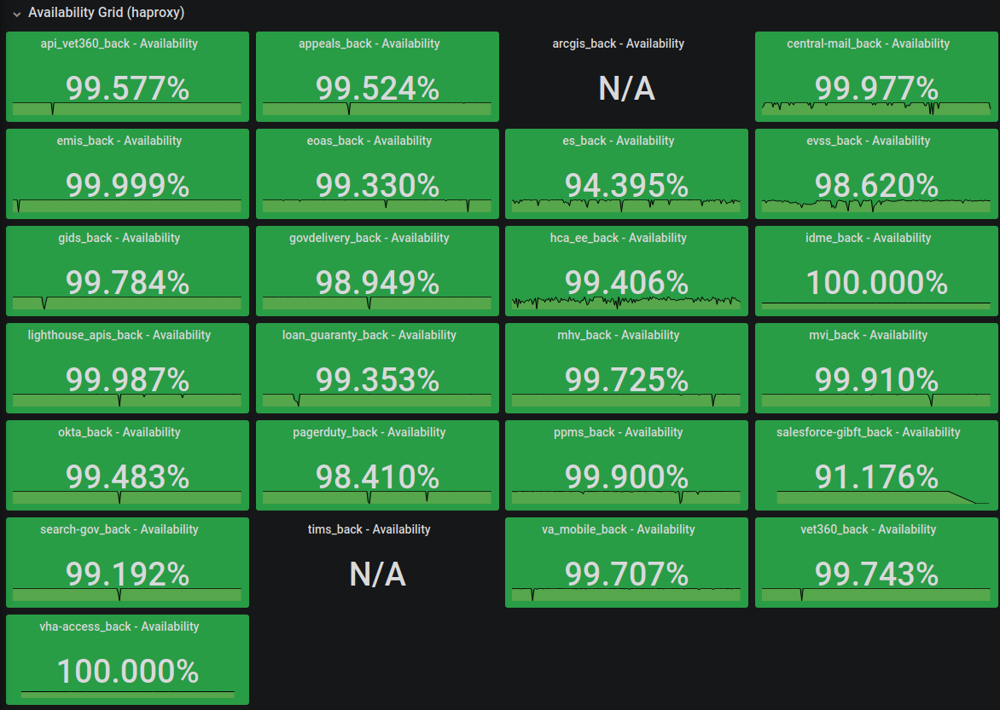
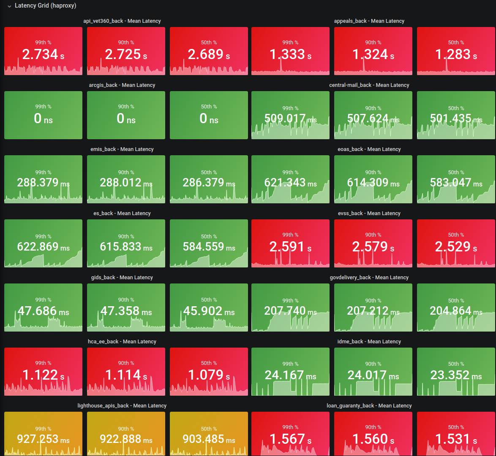
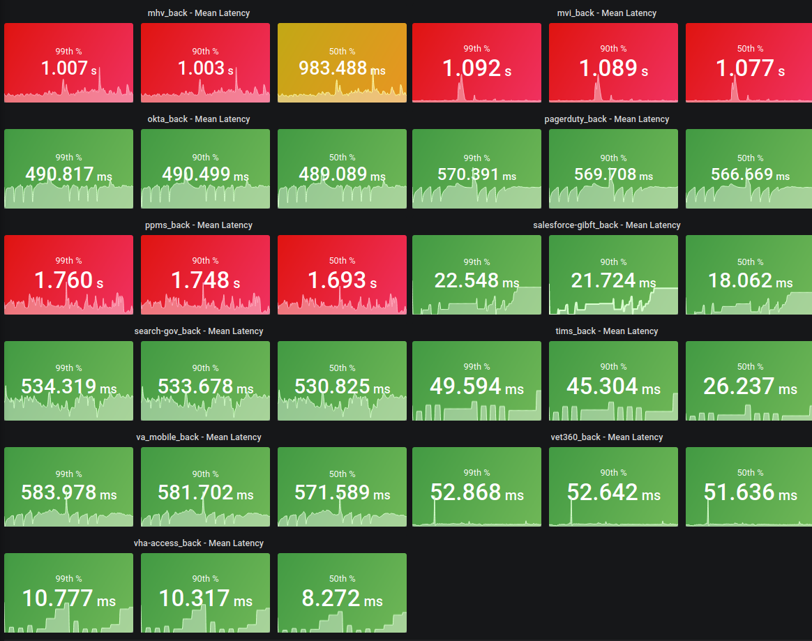

# SLO Performance Cumulative Overview

### Details

#### Availability Grid

*Note*: This is an aggregate of all metrics and may not be representative of actual performance averages.

#### Latency Grid

*Note*: This is an aggregate of all endpoint latency metrics and may not be representative of actual performance averages. Some transactions may perform slower and still meet baseline standards (`POST`, `PUT`, etc).

