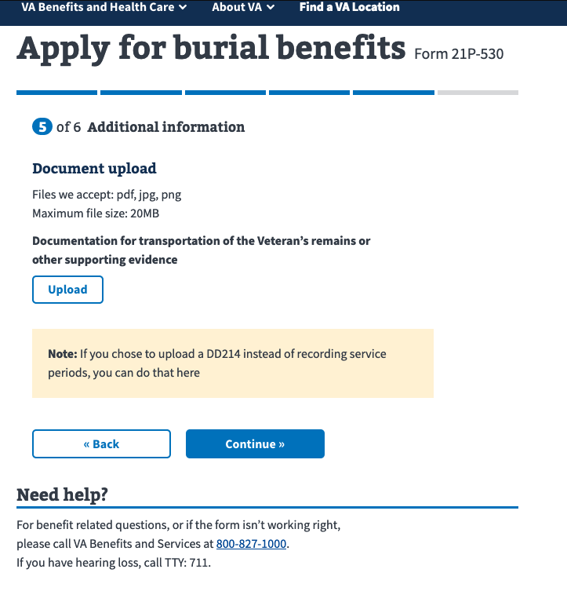

# burial claim attachments

## uploading claim attachments
On step 5 of 6 when applying for burial benefits you can upload attachments.




Claim attachments are POSTed to `v0/claim_attachments`, which is mapped to the `claim_documents_controller` here:

```ruby
# /config/routes.rb
...
  namespace :v0, defaults: { format: 'json' } do
    ...
    resource :claim_documents, only: [:create]
    resource :claim_attachments, only: [:create], controller: :claim_documents
    ...
...
```

__ClaimDocumentsController__

```ruby
module V0
  class ClaimDocumentsController < ApplicationController
    skip_before_action(:authenticate)

    def create
      PensionBurial::TagSentry.tag_sentry
      attachment = klass.new(form_id: form_id)
      # add the file after so that we have a form_id and guid for the uploader to use
      attachment.file = params['file']
      raise Common::Exceptions::ValidationErrors, attachment unless attachment.valid?

      attachment.save
      render json: attachment
    end

    private

    def klass
      case form_id
      when '21P-527EZ', '21P-530'
        PersistentAttachments::PensionBurial
      end
    end

    def form_id
      params[:form_id].upcase
    end
  end
end
```

`attachment` is of type `PersistentAttachments::PensionBurial`

```ruby
#/app/models/persistant_attachments/pension_burial.rb
class PersistentAttachments::PensionBurial < PersistentAttachment
  include ::ClaimDocumentation::Uploader::Attachment.new(:file)

  before_destroy(:delete_file)

  UPLOAD_TO_API_EMAILS = %w[
    lihan@adhocteam.us
  ].freeze

  def can_upload_to_api?
    UPLOAD_TO_API_EMAILS.include?(saved_claim.email)
  end

  private

  def delete_file
    file.delete
  end
end

```


The [https://shrinerb.com](https://shrinerb.com) uploader is mixed-in on the top `include..` line above. This is where validations are run on the file, including a virus scan.

__uploader__

```ruby
# app/uploaders/claim_documentation/uploader.rb
require 'shrine/plugins/validate_unlocked_pdf'

# Shrine logic for Pension/Burial uploads, optimistically named so
# that they cover any sort of claim documentation in a sane way.

class ClaimDocumentation::Uploader < VetsShrine
  plugin :storage_from_config, settings: Settings.shrine.claims
  plugin :activerecord, callbacks: false
  plugin :validate_unlocked_pdf
  plugin :store_dimensions

  Attacher.validate do
    validate_virus_free
    validate_max_size 20.megabytes
    validate_min_size 1.kilobytes
    validate_mime_type_inclusion %w[image/jpg image/jpeg image/png application/pdf]
    validate_max_width 5000 if get.width
    validate_max_height 10_000 if get.height
    validate_unlocked_pdf
  end
end
```

The uploader handles accepting the file (multi-part uploads), validations such as size, type, and performs a virus scan. The files are then place in cache for later processing (`process_attachments!`). The location of the cache is determined in the uploader.rb file (`plugin :storage_from_config, settings: Settings.shrine.claims`). For local dev, this ends up in `<approot>/tmp/claims/cache`.

__example uploads__


This is what a successful `POST` request/response looks like. `OPTIONS` is called before a POST (not shown), assuming to verify connectivity/CORS.

__REQUEST__
```ruby
POST /v0/claim_attachments HTTP/1.1
Host: localhost:3000
User-Agent: Mozilla/5.0 (Macintosh; Intel Mac OS X 10.15; rv:73.0) Gecko/20100101 Firefox/73.0
Accept: */*
Accept-Language: en-US,en;q=0.5
Accept-Encoding: gzip, deflate
X-Key-Inflection: camel
Content-Type: multipart/form-data; boundary=---------------------------28908348910181901091571462667
Content-Length: 127177
Origin: http://localhost:3001
Connection: close
Referer: http://localhost:3001/burials-and-memorials/application/530/documents

-----------------------------28908348910181901091571462667
Content-Disposition: form-data; name="file"; filename="cheatsheet-golang-A4.pdf"
Content-Type: application/pdf

%PDF-1.5
%ÐÔÅØ
130 0 obj
<<
/Length 2329      
/Filter /FlateDecode
>>
stream
xÚ½YéoÜ6ÿî¿bàE¶œ®E‹©#@HâºëÀnÝÄÁpŒBifTëðê°ëýß÷ñÒeٞI¼‹ù0E>þÞýøôîlgÿðY€—º³³åŒ9˜Î<ÏÃ4pfgÑì½K‹ÕÜr}endstream
# <CONTENT REMOVED FOR BREVITY> (lots of stream.. gibberish ..endstream sections)
endstream
endobj
startxref
126007
%%EOF

-----------------------------28908348910181901091571462667
Content-Disposition: form-data; name="form_id"

21P-530
-----------------------------28908348910181901091571462667--
```


__RESPONSE__

Note the GUID (`confirmationCode`) in the response. Also note that an `ETag` is generated and `Cache-Control` is set to never expire. This may be something we want to look into. Not clear why Git has headers.

```ruby
HTTP/1.1 200 OK
Access-Control-Allow-Origin: http://localhost:3001
Access-Control-Allow-Methods: GET, HEAD, POST, PUT, PATCH, DELETE, OPTIONS
Access-Control-Expose-Headers: X-RateLimit-Limit, X-RateLimit-Remaining, X-RateLimit-Reset, X-Session-Expiration
Access-Control-Max-Age: 7200
Access-Control-Allow-Credentials: true
X-Git-SHA: 1ab9e61a36ba1836bea70a11857cab56077f2de7
X-GitHub-Repository: https://github.com/department-of-veterans-affairs/vets-api
Content-Type: application/json; charset=utf-8
ETag: W/"594c5c5f1f094fee572136b9d2a3504b"
Cache-Control: max-age=0, private, must-revalidate
X-Request-Id: c9d9b249-c0b9-4126-83db-e4e5a0d5f3e7
X-Runtime: 14.955790
Vary: Origin
Connection: close
Content-Length: 188

{"data":{"id":"5","type":"persistent_attachments_pension_burials","attributes":{"confirmationCode":"1c140877-8f4d-452a-9993-9c38375263b3","name":"cheatsheet-golang-A4.pdf","size":126819}}}

```

Once a claim is submitted, the attachments are processed and uploaded to CentralMail via an asyn worker.

See my notes on `burial claims`