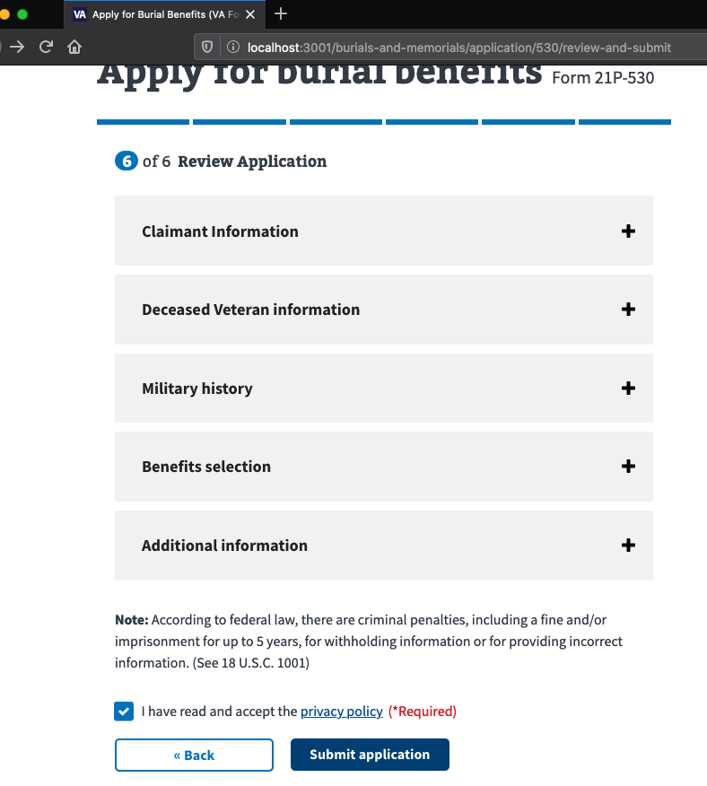

# burial claims


## submitting a claim



On the last step of the wizard, when a user submits a claim, a `POST` is made to `/v0/burial_claims`. This route is only available if central mail uploads are enabled as defined in `routes.rb`.

```ruby
# /config/routes.rb
...
    if Settings.central_mail.upload.enabled
      resources :pension_claims, only: %i[create show]
      resources :burial_claims, only: %i[create show]
    end
...
```

__burial claims controller__


By the time `POST /v0/burial_claims` is made, any supporting documents will have been uploaded, scanned, validated, and placed in a cache for future processing (async via workers). The `POST` content contains each files name, size, and confirmationCode (GUID) under the json tag `transportationReceipts`. I'm not sure if this matters, but obviously the front-end code assumed these would be what is uploaded. The front-end code should be adjusted to let the user know what type of documents are expected to be uploaded.

Note that the controller creates a `claim` of type `SavedClaim::Burial` dynamically, and `claim.save` is called early on in the `create` method.

```ruby
#/app/controllers/v0/burial_claims_controller.rb
module V0
  class BurialClaimsController < ClaimsBaseController
    def create
      PensionBurial::TagSentry.tag_sentry
      claim = claim_class.new(form: filtered_params[:form])

      unless claim.save
        StatsD.increment("#{stats_key}.failure")
        raise Common::Exceptions::ValidationErrors, claim
      end

      begin
        # veteran lookup for hit/miss metrics in support of Automation work
        BipClaims::Service.new.lookup_veteran_from_mvi(claim)
      ensure
        claim.process_attachments! # upload claim and attachments to Central Mail
      end

      relationship_type = claim.parsed_form['relationship']&.fetch('type', nil)
      StatsD.increment("#{stats_key}.success", tags: ["relationship:#{relationship_type}"])

      Rails.logger.info "ClaimID=#{claim.confirmation_number} Form=#{claim.class::FORM}"
      validate_session
      clear_saved_form(claim.form_id)
      render(json: claim)
    end

    def short_name
      'burial_claim'
    end

    def claim_class
      SavedClaim::Burial
    end
  end
end
```

The `BurialClaimsController` inherits from `ClaimsBaseController` as well. And although it says it is an 'abstract base controller', it is still tightly coupled to CentralMail. We will need to refactor `show` accordingly.

```ruby
# Abstract base controller for Claims controllers that use the SavedClaim
# and optionally, PersistentAttachment models. Subclasses must have:
#
# * `short_name()`, which returns an identifier that matches the parameter
#    that the form will be set as in the JSON submission.
# * `claim_class()` must return a sublass of SavedClaim, which will run
#    json-schema validations and perform any storage and attachment processing

# Current subclasses are PensionClaim and BurialClaim.

class ClaimsBaseController < ApplicationController
  skip_before_action(:authenticate)

  # Creates and validates an instance of the class, removing any copies of
  # the form that had been previously saved by the user.
  def create
    PensionBurial::TagSentry.tag_sentry
    claim = claim_class.new(form: filtered_params[:form])
    unless claim.save
      StatsD.increment("#{stats_key}.failure")
      raise Common::Exceptions::ValidationErrors, claim
    end
    claim.process_attachments!
    StatsD.increment("#{stats_key}.success")
    Rails.logger.info "ClaimID=#{claim.confirmation_number} Form=#{claim.class::FORM}"
    validate_session
    clear_saved_form(claim.form_id)
    render(json: claim)
  end

  def show
    render(json: CentralMailSubmission.joins(:central_mail_claim).where(saved_claims: { guid: params[:id] }).take)
  end

  private

  def filtered_params
    params.require(short_name.to_sym).permit(:form)
  end

  def stats_key
    "api.#{short_name}"
  end
end

```

The model for burial claims is defined here. Note the hardcoded `attachment_keys`, not sure where these tie in yet.

```ruby
#/app/models/saved_claim/burial.rb
class SavedClaim::Burial < CentralMailClaim
  FORM = '21P-530'

  def regional_office
    PensionBurial::ProcessingOffice.address_for(open_struct_form.claimantAddress.postalCode)
  end

  def attachment_keys
    %i[transportationReceipts deathCertificate].freeze
  end

  def email
    parsed_form['claimantEmail']
  end
end
```


`SavedClaim::Burial` inherits from `CentralMailClaim`. Note the `before_create` section. I could not find a method named `build_central_mail_submission`, so I assume it's more rails *magick*.

```ruby
# /app/models/central_mail_claim.rb
class CentralMailClaim < SavedClaim
  has_one(:central_mail_submission, inverse_of: :central_mail_claim, foreign_key: 'saved_claim_id', dependent: :destroy)

  before_create(:build_central_mail_submission)
end
```


`CentrailMailClaim` inherits from `SavedClaim`

```ruby
#/app/models/saved_claim.rb

class SavedClaim < ApplicationRecord
  include SetGuid

  validates(:form, presence: true)
  validate(:form_matches_schema)
  validate(:form_must_be_string)
  attr_encrypted(:form, key: Settings.db_encryption_key)

  has_many :persistent_attachments, inverse_of: :saved_claim, dependent: :destroy

  # create a uuid for this second (used in the confirmation number) and store
  # the form type based on the constant found in the subclass.
  after_initialize do
    self.form_id = self.class::FORM.upcase
  end

  def self.add_form_and_validation(form_id)
    const_set('FORM', form_id)
    validates(:form_id, inclusion: [form_id])
  end

  # Run after a claim is saved, this processes any files and workflows that are present
  # and sends them to our internal partners for processing.
  def process_attachments!
    refs = attachment_keys.map { |key| Array(open_struct_form.send(key)) }.flatten
    files = PersistentAttachment.where(guid: refs.map(&:confirmationCode))
    files.find_each { |f| f.update(saved_claim_id: id) }

    CentralMail::SubmitSavedClaimJob.perform_async(id)
  end

  def confirmation_number
    guid
  end
  
  ... #<content removed for brevity>

  private

  def attachment_keys
    []
  end
end

```

__processing attachments__

For each uploaded file, the claim_id is saved and the file is submitted to CentrailMail via a worker.

```ruby
...
# #/app/models/saved_claim.rb#process_attachments!
def process_attachments!
    refs = attachment_keys.map { |key| Array(open_struct_form.send(key)) }.flatten
    files = PersistentAttachment.where(guid: refs.map(&:confirmationCode))
    files.find_each { |f| f.update(saved_claim_id: id) }

    CentralMail::SubmitSavedClaimJob.perform_async(id)
end
...
```

Snippet from rails log showing files being loaded and submitted to sidekiq:

```ruby
ActiveRecord::Base --   PersistentAttachment Load (8.3ms)  SELECT  "persistent_attachments".* FROM "persistent_attachments" WHERE "persistent_attachments"."guid" IN ($1, $2) ORDER BY "persistent_attachments"."id" ASC LIMIT $3  [["guid", "1c140877-8f4d-452a-9993-9c38375263b3"], ["guid", "c058ed55-f2b1-41dd-b72b-0d1640c88df1"], ["LIMIT", 1000]]
2020-02-24 15:29:28.638382 I [6:puma threadpool 003] [[]] Rails -- [StatsD] shared.sidekiq.default.CentralMail_SubmitSavedClaimJob.enqueue:1|c
```

## CentralMail Worker

```ruby
#/app/workers/central_mail/submit_saved_claim_job.rb
require 'pdf_info'

module CentralMail
  class SubmitSavedClaimJob
    include Sidekiq::Worker

    FOREIGN_POSTALCODE = '00000'

    sidekiq_options retry: false

    class CentralMailResponseError < StandardError
    end

    def perform(saved_claim_id)
      PensionBurial::TagSentry.tag_sentry
      @claim = SavedClaim.find(saved_claim_id)
      @pdf_path = process_record(@claim)

      @attachment_paths = @claim.persistent_attachments.map do |record|
        process_record(record)
      end

      response = CentralMail::Service.new.upload(create_request_body)
      File.delete(@pdf_path)
      @attachment_paths.each { |p| File.delete(p) }

      if response.success?
        update_submission('success')
      else
        raise CentralMailResponseError
      end
    rescue
      update_submission('failed')
      raise
    end

    def create_request_body
      body = {
        'metadata' => generate_metadata.to_json
      }

      body['document'] = to_faraday_upload(@pdf_path)
      @attachment_paths.each_with_index do |file_path, i|
        j = i + 1
        body["attachment#{j}"] = to_faraday_upload(file_path)
      end

      body
    end

    def update_submission(state)
      @claim.central_mail_submission.update_attributes!(state: state)
    end

    def to_faraday_upload(file_path)
      Faraday::UploadIO.new(
        file_path,
        Mime[:pdf].to_s
      )
    end

    def process_record(record)
      pdf_path = record.to_pdf
      stamped_path1 = CentralMail::DatestampPdf.new(pdf_path).run(text: 'VA.GOV', x: 5, y: 5)
      CentralMail::DatestampPdf.new(stamped_path1).run(
        text: 'FDC Reviewed - va.gov Submission',
        x: 429,
        y: 770,
        text_only: true
      )
    end

    def get_hash_and_pages(file_path)
      {
        hash: Digest::SHA256.file(file_path).hexdigest,
        pages: PdfInfo::Metadata.read(file_path).pages
      }
    end

    # rubocop:disable Metrics/MethodLength
    def generate_metadata
      form = @claim.parsed_form
      form_pdf_metadata = get_hash_and_pages(@pdf_path)
      number_attachments = @attachment_paths.size
      veteran_full_name = form['veteranFullName']
      address = form['claimantAddress'] || form['veteranAddress']
      receive_date = @claim.created_at.in_time_zone('Central Time (US & Canada)')

      metadata = {
        'veteranFirstName' => veteran_full_name['first'],
        'veteranLastName' => veteran_full_name['last'],
        'fileNumber' => form['vaFileNumber'] || form['veteranSocialSecurityNumber'],
        'receiveDt' => receive_date.strftime('%Y-%m-%d %H:%M:%S'),
        'uuid' => @claim.guid,
        'zipCode' => address['country'] == 'USA' ? address['postalCode'] : FOREIGN_POSTALCODE,
        'source' => 'va.gov',
        'hashV' => form_pdf_metadata[:hash],
        'numberAttachments' => number_attachments,
        'docType' => @claim.form_id,
        'numberPages' => form_pdf_metadata[:pages]
      }

      @attachment_paths.each_with_index do |file_path, i|
        j = i + 1
        attachment_pdf_metadata = get_hash_and_pages(file_path)
        metadata["ahash#{j}"] = attachment_pdf_metadata[:hash]
        metadata["numberPages#{j}"] = attachment_pdf_metadata[:pages]
      end

      metadata
    end
    # rubocop:enable Metrics/MethodLength
  end
end

```

